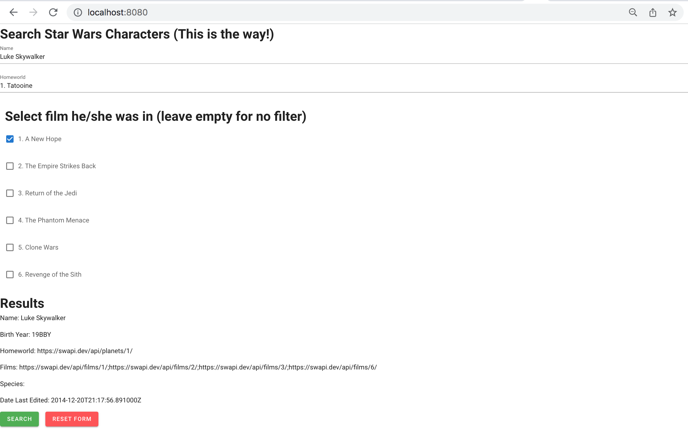

# wayfinder



## Quickstart

Just go here and try it out!

https://evansoohoo.github.io/ThisIsTheWay/

## Features

* Search for name (case sensitive, not optional), homeworld (optional), and one film.  If found, additional fields will autopopulate below

* Reset button

## Helpful Resources

* CodePen with the async/await call https://codepen.io/decodesalot/pen/jOPBeBN

* Vuetify documentation https://vuetifyjs.com/en/getting-started/installation/#vue-cli-install

* Hosting vue frontend statically on github pages https://medium.com/@Roli_Dori/deploy-vue-cli-3-project-to-github-pages-ebeda0705fbd

## Design Decisions

* This was using Vue2 and Vuetify. Name was a v-form, homeworld was a selector because there are 60 planets to choose from, and films was a checkbox because there are only six.  I approve of there only being six, as if 7-9 never happened.

* SUMMARY: This was using a few fetch calls; the layout was admittedly plain.  MORE DETAILS: Vuetify is meant to introduce Material Design, but it may have benefitted from a banner or the Star Wars logo.  I saw a few codepens that used this API and looked nicer.  I ultimately chose to base this on decodesalot's codepen, as it was the only one that worked, and all I could really take from that were modified fetch calls.  I looked at a vue publicly available git repos that used swapi, but did not end up using them...they did not work at all. In hindsight, maybe this could have been remedied by replacing the axios calls, which had CORS blocked issues, with fetch calls? I did not really want to debug

## Questions I would have asked (if I were allowed to relay questions instead of just getting 24 hours)

* This is just getting one match?  What if there were multiple?  It seems strange to me that it is implied there should only be one match, and that name, homeworld, and films are required fields.  Name alone will already narrow the list to one

* What if I wanted, instead, to search for people by homeworld?  There could be multiple.  If there were more than one result, would you like some sort of ranking criteria?

## If I had more time
* It would have been more convenient if name search was case insensitive

* You should be able to select multiple movies.  I could check multiple boxes if I moved the checkbox v-model value into return, but then the console would make warnings about no reactivity, the value itself would not be reactive, and it would not work, anyway.  A vue checkbox with multiple selections is a completely normal use case, and in fact you can find this for v-checkbox in the vuetify docs.  I am not sure why the browser had an issue with this for me

* A wireframe on draw.io may have been nice.  I just had a little piece of paper and wanted to focus on seeing if the calls would work

* Test cases.  Jest.  We were making async calls and using promises, so this might have made for some interesting test cases.  We could have just mocked success and failure, for the unit tests, but at least verified that certain things were set

## Project setup
```
yarn install
```

### Compiles and hot-reloads for development
```
yarn serve
```

### Compiles and minifies for production
```
yarn build
```

### Lints and fixes files
```
yarn lint
```

### Customize configuration
See [Configuration Reference](https://cli.vuejs.org/config/).
